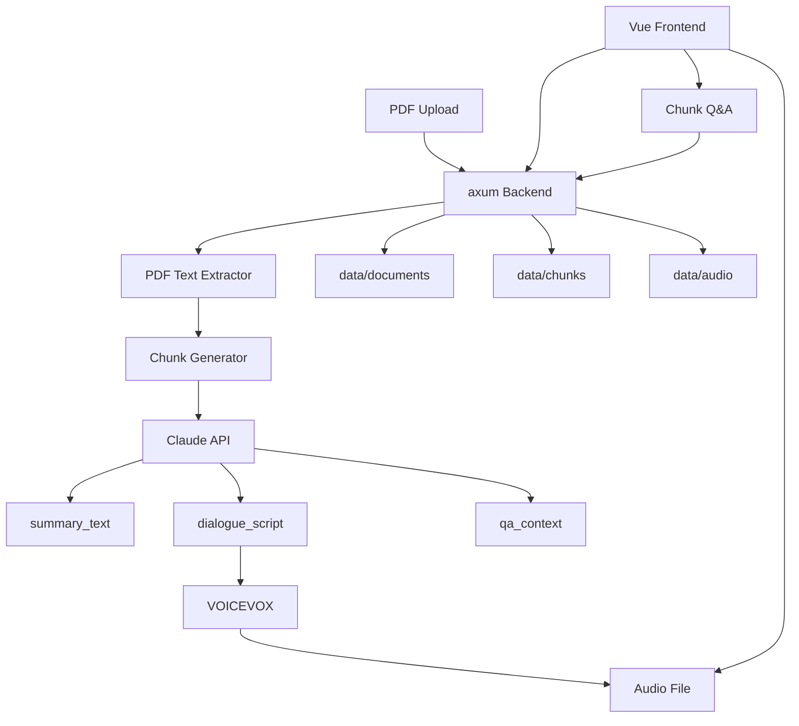

# PDF Reading Radio

PDF をアップロードし、数ページずつ Claude で要約・解説させ、その生成結果を音声化して再生しながら、今読んでいる範囲について質疑応答できるローカル向けアプリ。

## MVP の目的

- ローカルで PDF を扱える
- PDF を数ページ単位の chunk に分けられる
  - 現在は `5ページ目` から chunk 化する
- chunk ごとに Claude で以下を生成できる
  - 表示用要約
  - 読み上げ用原稿
  - Q&A 用コンテキスト
- 読み上げ用原稿を VOICEVOX で音声化できる
- フロントエンドから再生 / 停止できる
- 今再生中の chunk だけに対して質問できる

## ローカル MVP アーキテクチャ



## 技術方針

- フロントエンド: `Vue`
- バックエンド: `Rust + axum`
- LLM: `Claude Code CLI` を `LlmClient` 経由で呼ぶ
- 音声合成: `VOICEVOX`
- 初期保存: ローカルファイル
- 将来インフラ: `AWS + Terraform`

## データモデル

### `Document`

PDF 全体を表す。

```rust
pub struct Document {
    pub id: String,
    pub title: String,
    pub file_name: String,
    pub total_pages: u32,
    pub created_at: String,
}
```

### `BookChunk`

数ページ単位の理解・再生・Q&A の最小単位。

```rust
pub struct BookChunk {
    pub id: String,
    pub document_id: String,
    pub title: String,
    pub page_start: u32,
    pub page_end: u32,
    pub source_text: String,
    pub key_points: Vec<String>,
    pub summary_text: String,
    pub dialogue_script: String,
    pub qa_context: String,
    pub audio_path: Option<String>,
}
```

## API 叩き台

### `GET /api/health`

- 動作確認

### `GET /api/documents`

- ドキュメント一覧取得

### `POST /api/documents`

- PDF アップロード
- `data/documents/<document_id>.pdf` に保存
- `data/documents/<document_id>.json` にメタデータ保存
- `data/chunks/<chunk_id>.json` に chunk 保存
  - 先頭 4 ページはスキップし、5 ページ目から chunk を作る

### `POST /api/documents/:id/generate`

- ドキュメントに属する全 chunk を Claude で一括生成

### `GET /api/documents/:id/chunks`

- ドキュメントに属する chunk 一覧取得

### `GET /api/chunks/:id`

- chunk 1 件の詳細取得

### `POST /api/chunks/:id/generate`

- chunk 1 件だけ Claude で生成し直す

### `POST /api/chunks/:id/audio`

- `dialogue_script` を VOICEVOX で wav 化
- `data/audio/<chunk_id>.wav` に保存
- `chunk.audio_path` を `/audio/<chunk_id>.wav` に更新

### `POST /api/chunks/:id/qa`

- 入力
  - `question`
- 出力
  - `answer`
  - `references`

## ローカル開発の進め方

1. `claude` CLI にログインする
2. `backend/` の axum API を起動する
3. `VOICEVOX` Engine を起動する
4. `frontend/` の Vue UI を起動する
5. ブラウザから PDF をアップロードする
6. chunk ごとに生成・音声化・Q&A を試す

## 現在のローカルワークフロー

```bash
cd backend
cargo run
```

VOICEVOX を Docker で起動:

```bash
docker run --rm -p 50021:50021 voicevox/voicevox_engine:cpu-latest
```

フロントエンドを起動:

```bash
cd frontend
npm install
npm run dev
```

必要なら API の向き先は `VITE_API_BASE_URL` で変更:

```bash
VITE_API_BASE_URL=http://127.0.0.1:3000 npm run dev
```

ブラウザで `http://127.0.0.1:5173` を開くと、以下を 1 画面で操作できる。

- PDF アップロード
- document / chunk 選択
- Claude 生成
- VOICEVOX 音声生成
- 音声再生
- chunk 単位 Q&A

別ターミナルで PDF をアップロード:

```bash
curl -X POST http://127.0.0.1:3000/api/documents \
  -F "file=@/absolute/path/to/book.pdf"
```

一部の chunk を生成:

```bash
curl -X POST http://127.0.0.1:3000/api/chunks/<chunk_id>/generate
```

ドキュメント全体を生成:

```bash
curl -X POST http://127.0.0.1:3000/api/documents/<document_id>/generate
```

音声を生成:

```bash
curl -X POST http://127.0.0.1:3000/api/chunks/<chunk_id>/audio
```

生成済み音声を再生:

```bash
curl http://127.0.0.1:3000/audio/<chunk_id>.wav --output sample.wav
```

質問する:

```bash
curl -X POST http://127.0.0.1:3000/api/chunks/<chunk_id>/qa \
  -H "Content-Type: application/json" \
  -d '{"question":"この範囲の主張は何？"}'
```

## ディレクトリ案

```text
.
├── README.md
├── backend/
├── frontend/
├── data/
│   ├── documents/
│   ├── chunks/
│   └── audio/
└── infra/
    └── terraform/
```

## 将来の AWS 移行イメージ

ローカル MVP が固まったら、以下の順で AWS へ寄せる。

1. 音声ファイルを `S3` に保存
2. API を `ECS` か `Lambda + Function URL` に配置
3. PDF / chunk メタデータを `DynamoDB` か `PostgreSQL` に移す
4. 音声配信を `CloudFront` 経由にする
5. Terraform で環境を再現可能にする

## 次にやること

1. PDF テキスト抽出ライブラリを決める
2. chunk のページ幅を `3` か `5` に決める
3. Claude に返させる JSON スキーマを固定する
4. VOICEVOX の起動方法を決める
5. フロントに再生キューと現在再生中状態を入れる
